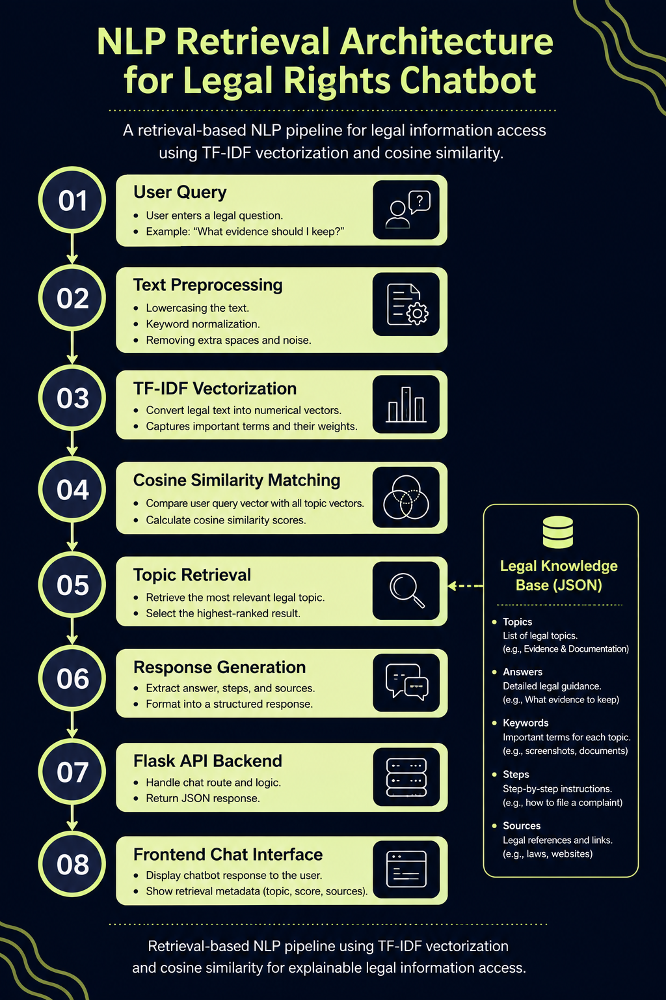
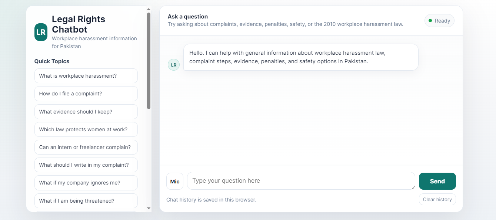
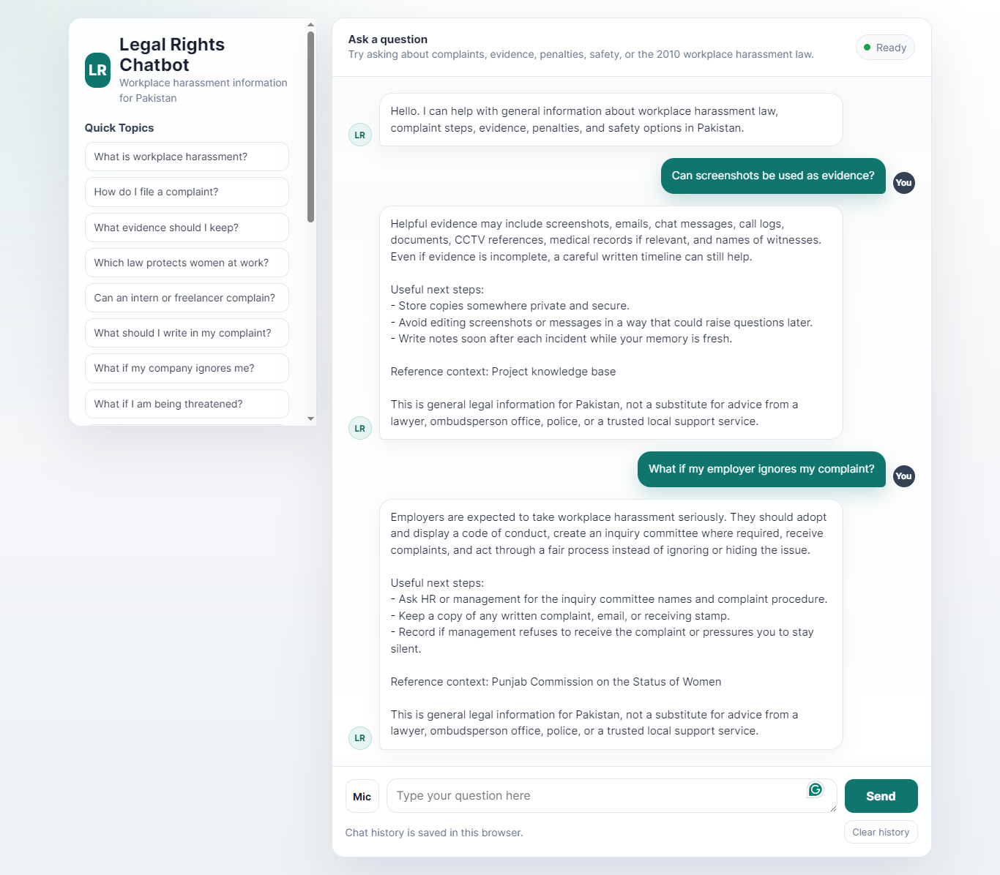
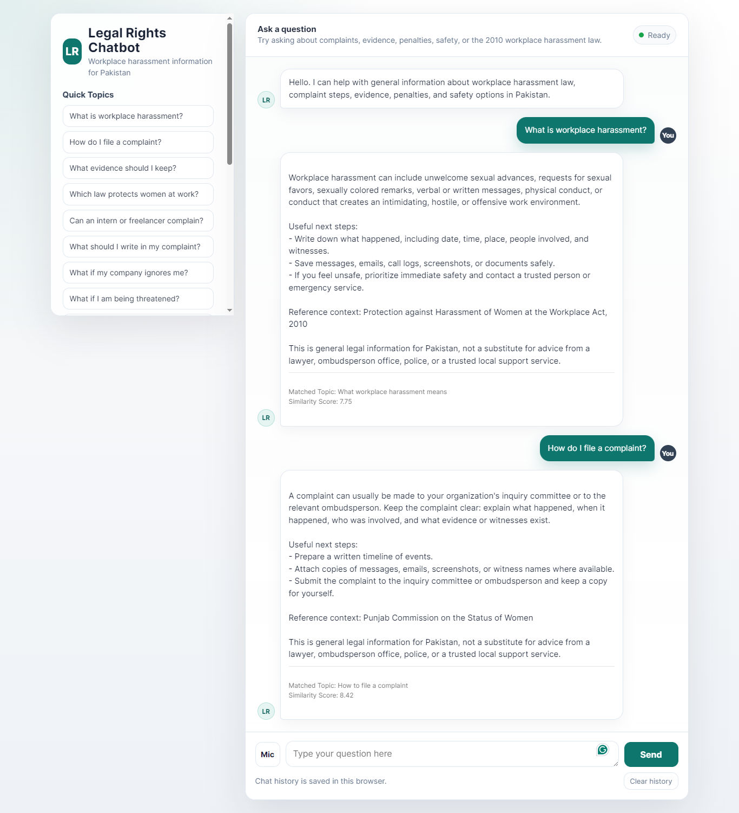
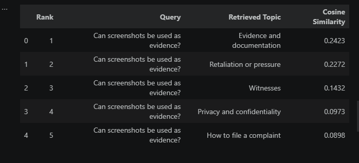
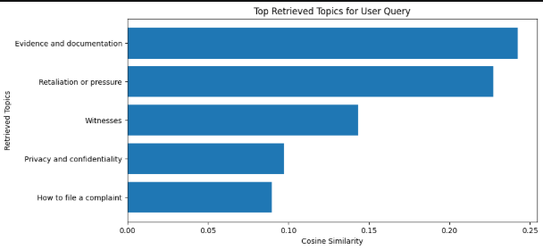

# Legal Rights NLP Chatbot

A retrieval-based NLP chatbot focused on workplace harassment awareness and legal information access in Pakistan.

The project is designed as a Computational Linguistics / NLP portfolio system that maps natural-language user queries to a curated legal knowledge base using:

- TF-IDF vectorization
- cosine similarity retrieval
- keyword scoring
- structured response generation

The chatbot provides general legal information only. It is not a substitute for advice from a lawyer, ombudsperson office, police, court, or trusted local support service.

---

# System Architecture

!<p align="center">
  
</p>

---

# Chatbot Interface

## Homepage Interface



## Example Conversation



---

# Retrieval Evaluation

The system retrieves the most relevant legal topic using TF-IDF vectorization and cosine similarity ranking.

## Retrieval Metadata Example



---

# NLP Retrieval Analysis

The project includes a Jupyter notebook for retrieval experimentation and evaluation.

## Retrieval Ranking Table



## Cosine Similarity Visualization



---

# Key Features

- Flask web application with JSON chat API
- Curated legal knowledge base in `data/legal_knowledge.json`
- TF-IDF query-document matching with unigram and bigram features
- Graceful keyword-only fallback when `scikit-learn` is unavailable
- Optional OpenAI response generation grounded in retrieved knowledge-base context
- Responsive browser chat interface with quick prompts and local chat history
- `/topics` endpoint for dataset inspection
- `/health` endpoint for service and matching-mode status
- Unit tests for dataset loading, retrieval behavior, and API endpoints
- Cosine similarity ranking
- Domain-specific keyword scoring
- Structured legal knowledge base in JSON format
- Explainable retrieval metadata
- Responsive frontend chat interface
- Quick-prompt legal guidance system
- Optional OpenAI context-grounded generation
- Local retrieval fallback system
- Unit and endpoint testing
- Retrieval evaluation notebook

---

# NLP Methodology

The system treats each legal topic as a retrievable document.

Each topic document is constructed from:
- title
- keywords
- example questions
- legal guidance answer
- procedural steps

User queries are:
1. normalized
2. vectorized using TF-IDF
3. compared against topic documents using cosine similarity
4. ranked using hybrid lexical scoring

This makes the project a small-domain information retrieval system rather than an open-domain generative chatbot.

Core NLP concepts demonstrated:
- document representation
- sparse vector retrieval
- TF-IDF weighting
- n-gram features
- cosine similarity
- lexical overlap
- explainable retrieval
- threshold-based fallback behavior

Detailed methodology: [docs/methodology.md](docs/methodology.md)

## Architecture Summary

```text
Browser UI
  -> Flask API Backend
  -> TF-IDF Retrieval Engine
  -> optional OpenAI context-grounded generation
  -> Cosine Similarity Matching
  -> structured legal knowledge base
  -> formatted response with disclaimer
  -> Fronted Display
```

Project structure:

```text
chatbot_project/
  app.py                         Flask routes, API workflow, optional OpenAI layer
  chatbot_engine.py             Knowledge-base loading, TF-IDF indexing, retrieval, formatting
requirements.txt
data/
    legal_knowledge.json         Structured topic corpus
templates/
    index.html                   Browser chat interface
tests/
    test_chatbot.py              Unit and endpoint tests
notebooks/
    retrieval_analysis.ipynb
docs/
    methodology.md               NLP and retrieval methodology
    error_analysis.md            Retrieval failure modes and limitations
    future_work.md               Multilingual and low-resource NLP directions
reports/ 
    evaluation_examples.md       Qualitative retrieval examples
```

Additional documentation:

- [Architecture diagram](docs/architecture_diagram.md)
- [System architecture](docs/system_architecture.md)
- [NLP pipeline](docs/nlp_pipeline.md)
- [API workflow](docs/api_workflow.md)
- [Dataset structure](docs/dataset_structure.md)
- [Query processing pipeline](docs/query_processing_pipeline.md)
- [Evaluation examples](reports/evaluation_examples.md)
- [Retrieval evaluation examples](reports/retrieval_evaluation_examples.md)

# Technologies Used

- Python
- Flask
- HTML / CSS / JavaScript
- Scikit-learn
- TF-IDF Vectorization
- Cosine Similarity
- JSON Knowledge Base
- Jupyter Notebook
```

## Setup

Install dependencies:

```powershell
pip install -r requirements.txt
```

Run the app:

```powershell
python app.py
```

Open the browser interface:

```text
http://127.0.0.1:5000
```

## Optional OpenAI Integration

The application works without an API key. To enable optional context-grounded generation, create or update `.env`:

```text
ENABLE_OPENAI=true
OPENAI_API_KEY=your_key_here
OPENAI_MODEL=your_model_here
```

When enabled, the app sends the top retrieved knowledge-base context with the user query. If the API call fails, the system falls back to local retrieval.

## Testing

Run with Python's built-in test runner:

```powershell
python -m unittest discover
```

Or with pytest:

```powershell
pytest
```

## Research Direction

The current system is an English-language sparse retrieval prototype. Future work focuses on Roman Urdu NLP, multilingual retrieval, code-switching detection, semantic embeddings, transformer-based reranking, and low-resource legal information retrieval.

Future work details: [docs/future_work.md](docs/future_work.md)
