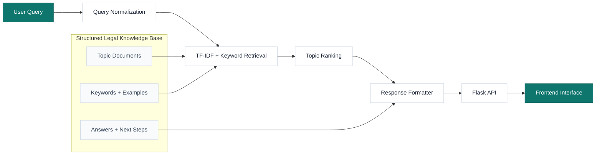

# Architecture Diagram

This diagram shows the main query-to-response pipeline for the retrieval-based NLP legal chatbot.

## Pipeline Summary

1. **User Query:** the user enters a natural-language workplace harassment question.
2. **Query Normalization:** text is lowercased, stripped, and whitespace-normalized.
3. **TF-IDF + Keyword Retrieval:** the query is compared against topic documents using sparse vector similarity and domain keyword scoring.
4. **Topic Ranking:** topics are ranked by combined retrieval score.
5. **Response Formatter:** the selected topic is converted into an answer with practical next steps, source context, and disclaimer.
6. **Flask API:** the response is returned through the `/chat` JSON endpoint.
7. **Frontend Interface:** the browser chat UI displays the response.
